# Ingress

  - Take me to [Lecture](https://kodekloud.com/courses/certified-kubernetes-administrator-with-practice-tests/lectures/9808286)

In this section, we will take a look at **Ingress**

- Ingress Controller
- Ingress Resources

## Basic Deployment
 
 

  ```
  Deployment: 
    web application : wear
    Backend : mySQL

  Service:
    mysql-service [ClusterIP] : For Backend
    wear-service [NodePort] : For Access Web Application


  User Access Application: http://<nodeIP>: 38080

  ```

## Problem Faced by User

  - User Access the Application using the FQDN instead of IP hence you need to provision the DNS Entry in the DNS Server. Now User can access application using: http://my-online-store.com:38080

  - Also you dont want user to remember the port to access the application, since the nodePort exposes ports in range of 30000-32767


## Solution 1 : On Premises Proxy Server

  - Now User can access application : http://my-online-store.com

  	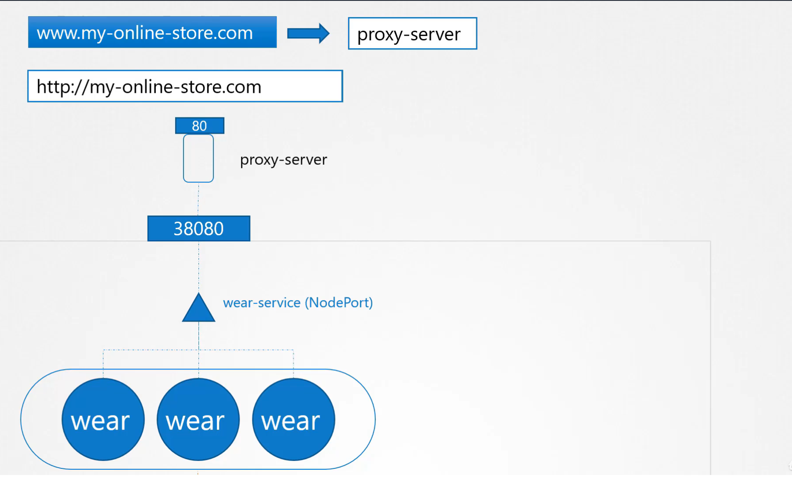

## Solution 2 : On Public Cloud

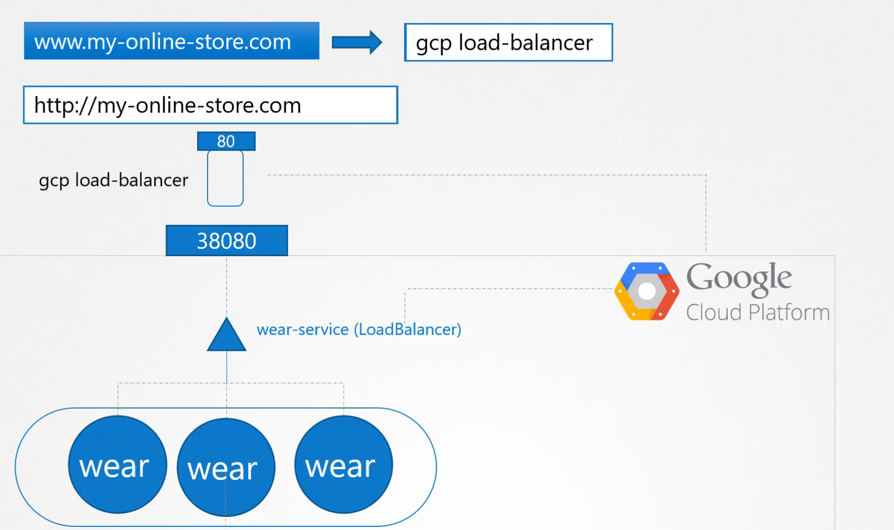

- User creates LoadBalance Type of Service instead of NodePort

- In this case a public IP is assigned to the LB along with the prepopulated DNS Entry

- Now User can access application : http://my-online-store.com      
  	  Where my-online-store is point to the public IP Address of the LB


## Deploying Multiple Web Services


- For every web application you need to create seperate LB which is expensive in the Cloud


## K8S Ingress Solution

- ingress helps your users access your application using a single Externally accessible URL, that you can configure to route to different services within your cluster based on the URL Path and SSL Security

- Ingress is kind of L7 load balancer buildin with in k8S cluster

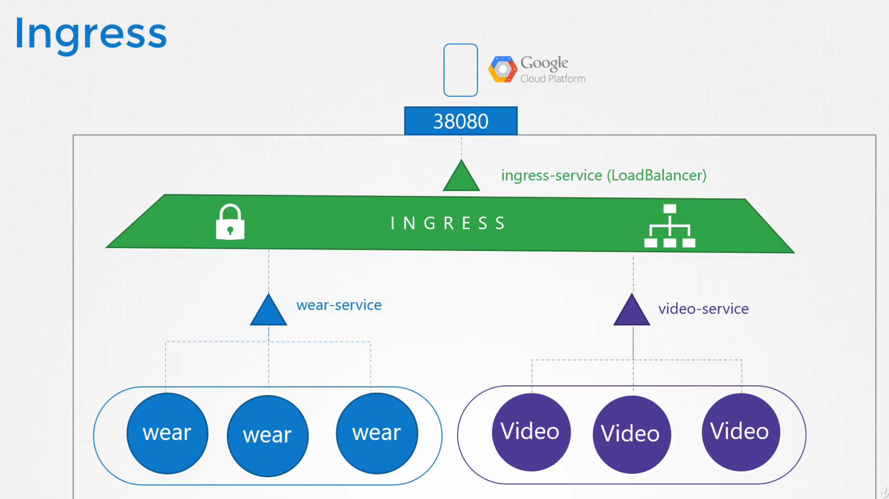


## How it works
  
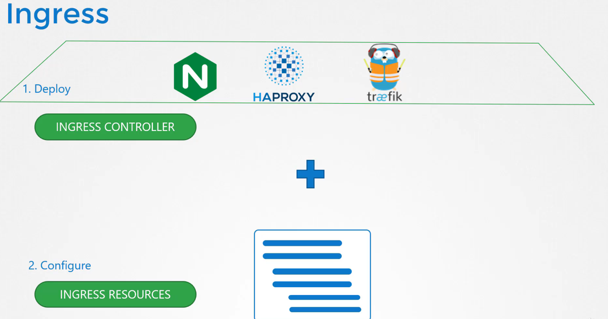

- Deploy a Reverse Proxy and Configure it to route traffic to other services

- The solution you deploy is called as an ingress controller and the set of rules you configure are called as ingress resources. ingress resources are created using definition files


## Ingress Controller

- Not deployed by default

- GCP and Nginx is currently maintained and Supported by K8S project, but there are other solutions too.

- Nginx Ingress Controller is deployed as deployment in K8S

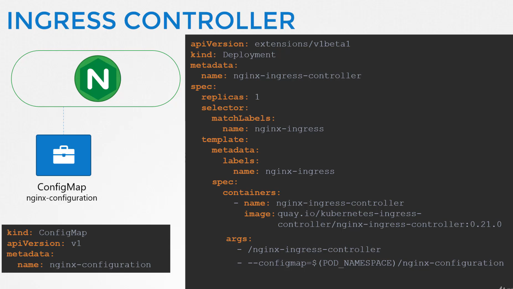

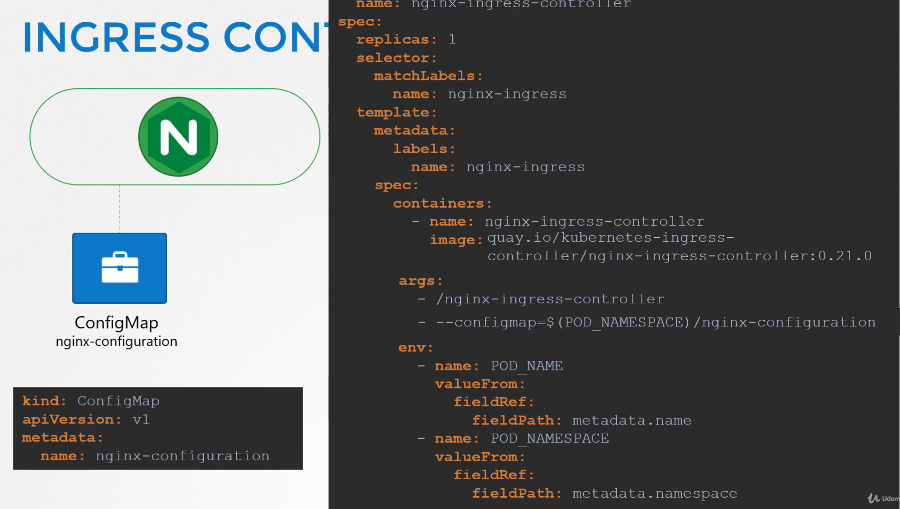

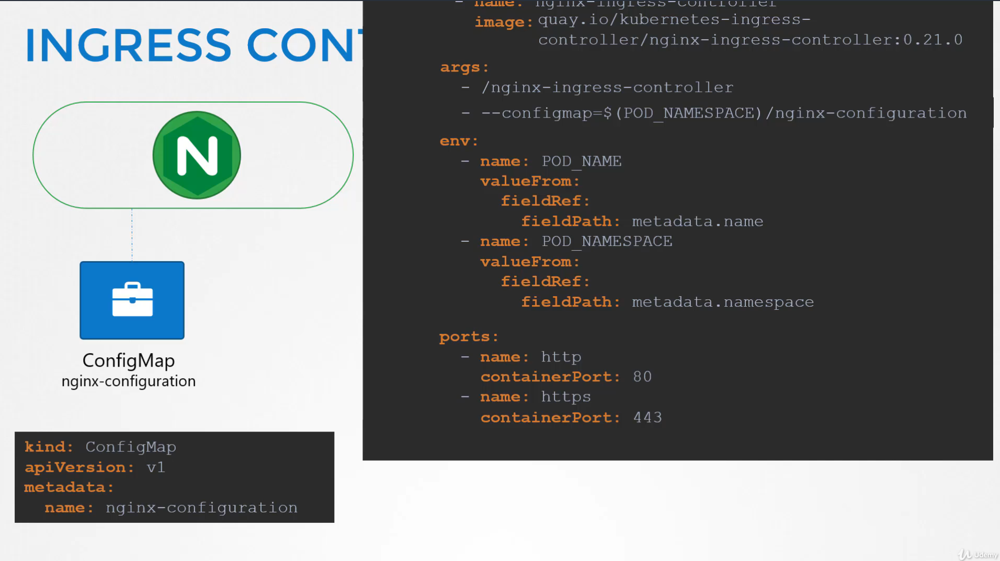


- We then need a service to expose the ingress controller to the external world. So we create a service of type NodePort with the nginx-ingress label selector to link the service to the deployment.


- Ingress controller need required permission so it requires a service account with a right set of permissions for that we create a service account with the correct roles and roles bindings.

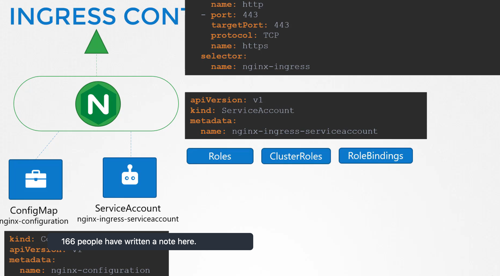

- Summary
 	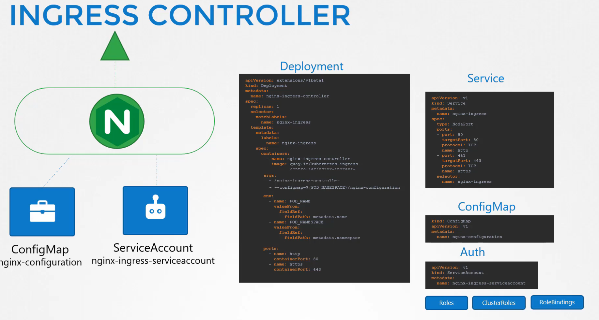


 ## Ingress Resources

 - ingress resources is a set of rules and configurations applied on the ingress controller. You can configure rules to say simply forward all incoming traffic to a single application or route traffic to different applications.

 


 - Ingress yaml
 	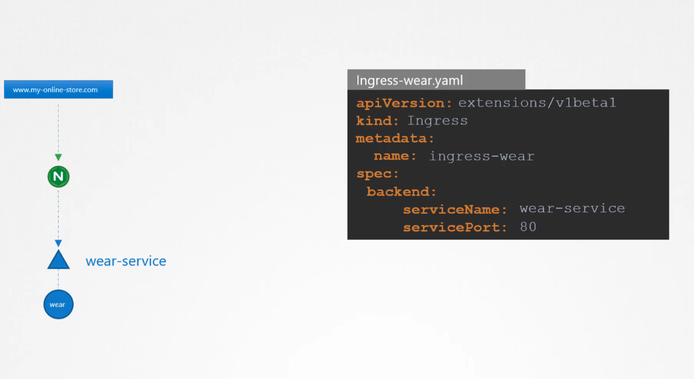

 - For a single backend then you don't really have any rules.

 ## Ingress Rules

 - Rules are used when you want to route traffic based on different conditions.

 - You create one rule for traffic originating for each domain or hostname.
 	  i.e for different applications or domain name you have to define multiple rules for different applications
 	
 - Now within each rule you can handle different paths. For example, within Rule 1 you can handle the wear path to route that traffic to the clothes application. And a watch path to route traffic to the video streaming application. 


 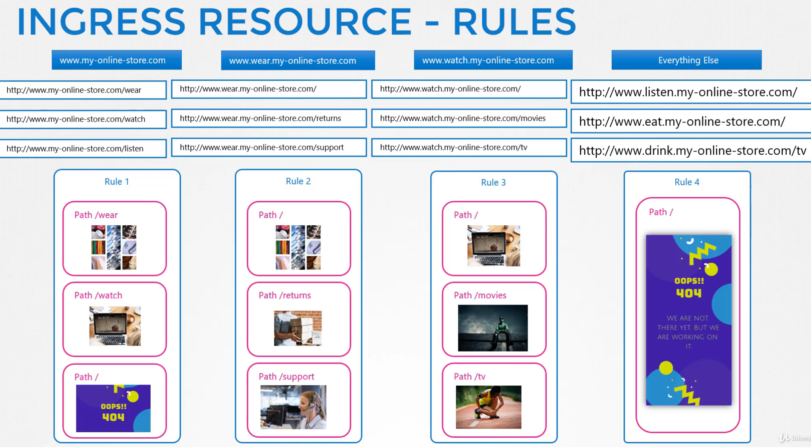


 ## Configure ingress in K8S
   
 - **** Single Rule with multiple Paths

   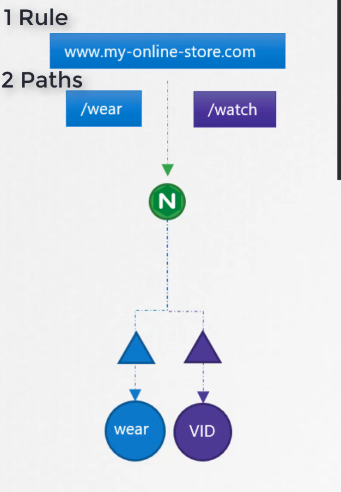

   

   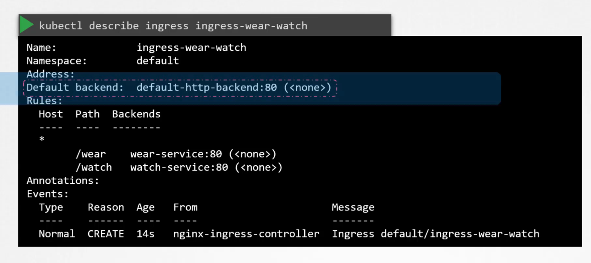

    - What is the Default backend in the above output ? 
     
	  - If a user tries to access a URL that does not match any of these rules, Then the user is directed to the service specified as the default backend.

	  - In this case it happens to be a service named default-http-backend. So you must remember to deploy such a service back in your application. Say a user visits the URL my-online-store.com/listen or /eat and you don’t have an audio streaming or a food delivery service. You might want to show them a nice message. You can do this by configuring a default backend service to display this 404 Not found error page.

	  


 - **** With Multiple Rules

   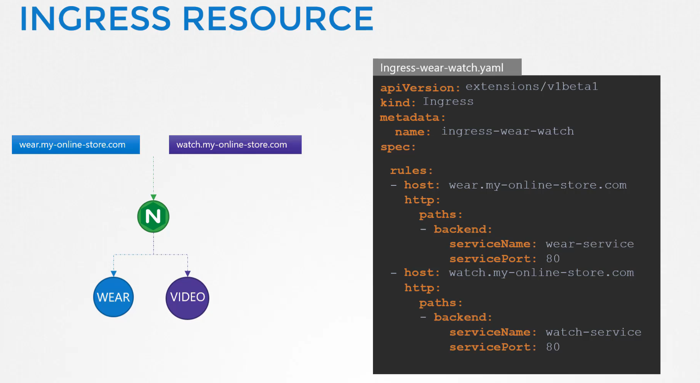


   - If you don't specify the host field it will simply consider it as a star or accept all the incoming traffic through that particular rule without matching the hostname. Note that we only have a single backend path for each rule which is fine.

   - You can still have multiple path specifications in each of these to handle different URL paths


 - **** Comparing

  - Splitting traffic by URL that just had one rule and we split the traffic with two paths.
  - Display traffic by hostname. We used two rules and one path specification in each rule.


   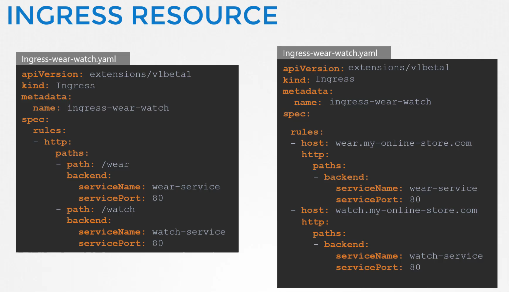


## Ingress Controller

- Deployment of **Ingress Controller**

## ConfigMap

```
kind: ConfigMap
apiVersion: v1
metadata:
  name: nginx-configuration
```

## Deployment

```
apiVersion: apps/v1
kind: Deployment
metadata:
  name: ingress-controller
spec:
  replicas: 1
  selector:
    matchLabels:
      name: nginx-ingress
  template:
    metadata:
      labels:
        name: nginx-ingress
    spec:
      serviceAccountName: ingress-serviceaccount
      containers:
        - name: nginx-ingress-controller
          image: quay.io/kubernetes-ingress-controller/nginx-ingress-controller:0.21.0
          args:
            - /nginx-ingress-controller
            - --configmap=$(POD_NAMESPACE)/nginx-configuration
          env:
            - name: POD_NAME
              valueFrom:
                fieldRef:
                  fieldPath: metadata.name
            - name: POD_NAMESPACE
              valueFrom:
                fieldRef:
                  fieldPath: metadata.namespace
          ports:
            - name: http
              containerPort: 80
            - name: https
              containerPort: 443
```

## ServiceAccount

- ServiceAccount require for authentication purposes along with correct Roles, ClusterRoles and RoleBindings.

- Create a ingress service account
```
$ kubectl create -f ingress-sa.yaml
serviceaccount/ingress-serviceaccount created
```

## Service Type - NodePort

```
# service-Nodeport.yaml

apiVersion: v1
kind: Service
metadata:
  name: ingress
spec:
  type: NodePort
  ports:
  - port: 80
    targetPort: 80
    protocol: TCP
    name: http
  - port: 443
    targetPort: 443
    protocol: TCP
    name: https
  selector:
    name: nginx-ingress
```

- Create a service
```
$ kubectl create -f service-Nodeport.yaml
```
- To get the service

```
$ kubectl get service
```

## Ingress Resources

```
Ingress-wear.yaml

apiVersion: extensions/v1beta1
kind: Ingress
metadata:
  name: ingress-wear
spec:
     backend:
        serviceName: wear-service
        servicePort: 80
```

- To create the ingress resource
```
$ kubectl create -f Ingress-wear.yaml
ingress.extensions/ingress-wear created
```

- To get the ingress
```
$ kubectl get ingress
NAME           CLASS    HOSTS   ADDRESS   PORTS   AGE
ingress-wear   <none>   *                 80      18s
```

## Ingress Resource - Rules

- 1 Rule and 2 Paths.

```
apiVersion: extensions/v1beta1
kind: Ingress
metadata:
  name: ingress-wear-watch
spec:
  rules:
  - http:
      paths:
      - path: /wear
        backend:
          serviceName: wear-service
          servicePort: 80
      - path: /watch
        backend:
          serviceName: watch-service
          servicePort: 80
```
- Describe the earlier created ingress resource

```
$ kubectl describe ingress ingress-wear-watch
Name:             ingress-wear-watch
Namespace:        default
Address:
Default backend:  default-http-backend:80 (<none>)
Rules:
  Host        Path  Backends
  ----        ----  --------
  *
              /wear    wear-service:80 (<none>)
              /watch   watch-service:80 (<none>)
Annotations:  <none>
Events:
  Type    Reason  Age   From                      Message
  ----    ------  ----  ----                      -------
  Normal  CREATE  23s   nginx-ingress-controller  Ingress default/ingress-wear-watch

```

- 2 Rules and 1 Path each.
```
# Ingress-wear-watch.yaml

apiVersion: extensions/v1beta1
kind: Ingress
metadata:
  name: ingress-wear-watch
spec:
  rules:
  - host: wear.my-online-store.com
    http:
      paths:
      - backend:
          serviceName: wear-service
          servicePort: 80
  - host: watch.my-online-store.com
    http:
      paths:
      - backend:
          serviceName: watch-service
          servicePort: 80
```


#### References Docs

- https://kubernetes.io/docs/concepts/services-networking/ingress/
- https://kubernetes.io/docs/concepts/services-networking/ingress-controllers/
- https://thenewstack.io/kubernetes-ingress-for-beginners/
